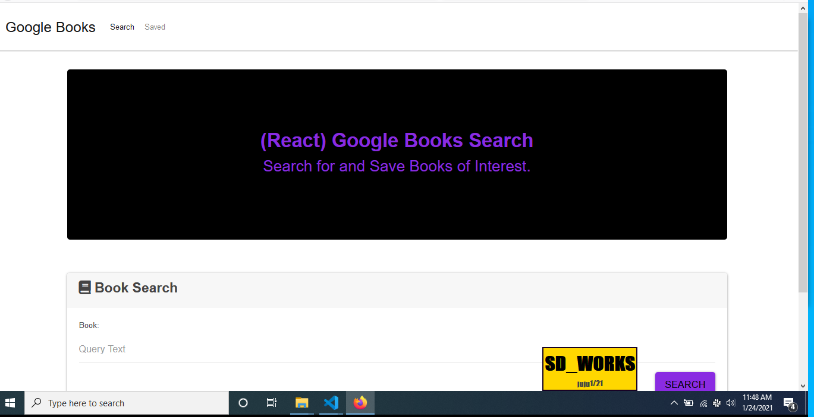

# Google-Books

A MERN app to search and save a list of books from a google api!

Project Live Link: https://google-books-hmwk.herokuapp.com/

## Table of contents
- [Description](#Description)
- [Usage](#Usage-Notes)
- [Created By](#Created-By)
- [Repository Link](#Repository)

## Description 
  A simple app that lets you search through a google books api and save your results to a database.

#### NPM Install, installs the following

## Usage Notes
* Type the book you want to search in the first box under the Heading
* Click the Search button
* The results are populated underneath the search box
* Click Save to add the book to a database that populates your saved books on the Saved page
* Or click View to get more details about the book that opens in a new tab
* On the top section of the app their is a navbar to toggle between the Search page and the Saved page
* On the Saved page, you can see a list of your saved books, view more details of each book or delete a book from your saved list!

## Created By
[MrDawit Shalom Dawit](https://github.com/MrDawit) \
Email: Shalom.Dawit@Gmail.com 

## Repository
[Project Repo](https://github.com/MrDawit/Google-Books)

